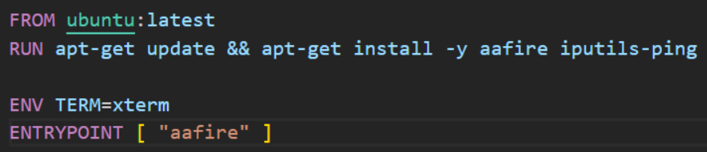
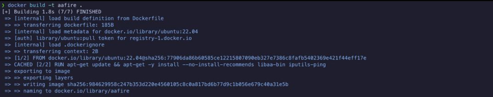
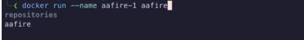
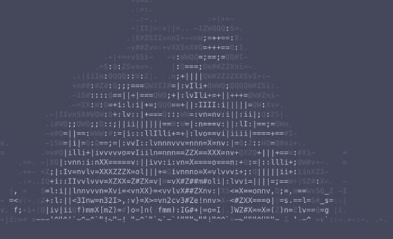
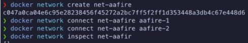
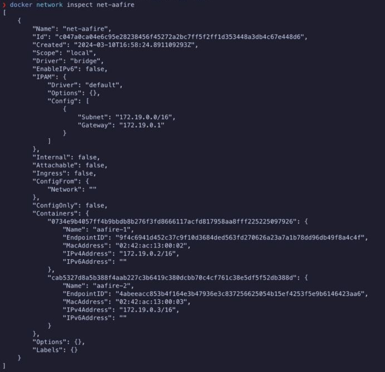
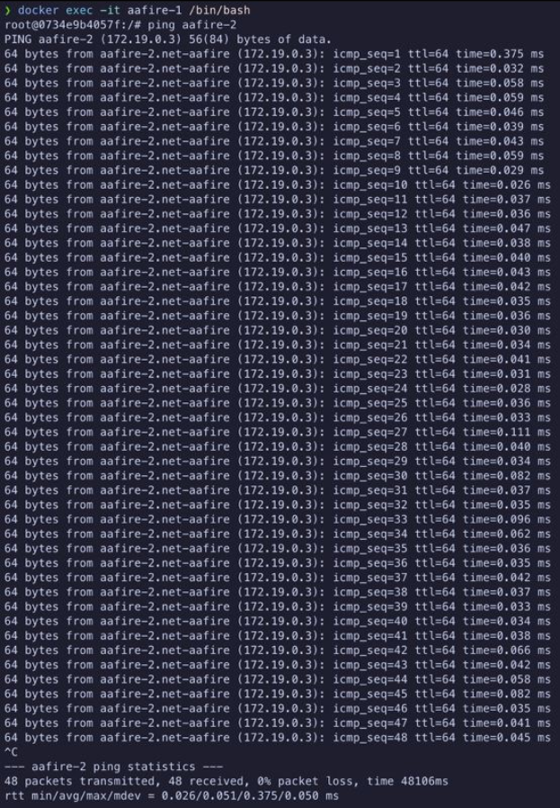
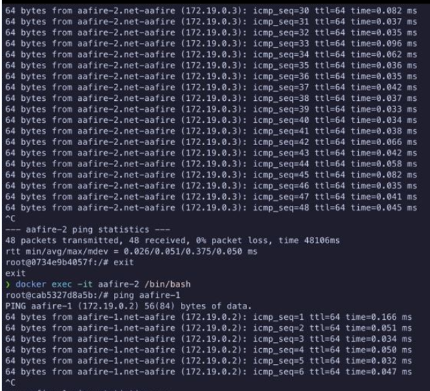

# Отчет по лабораторной работе 4 by Stepanov Kirill  
Была задача запустить в контейнере приложение "aafire".  
Для решения создаем Dockerfile, переменная окружения ENV TERM=xterm  
для корректного отображения текстовых интерфейсов и работы с инструментами, использующими терминальные возможности,  
а ENTRYPOINT, чтобы сразу по открытию запустить программу и запихиваем ping на будущее  
 
Дальше билдим и раним:
 
  
Получаем что-то от Бога...  
  

Далее настраиваем сеть между контейнерами:  
  
и выводим полную информацию о ней с помощью docker network inspect:  
  
и пропинговываем через первый второй контейнер, а потом через второй первый, чтобы показать их связь:
  
  
